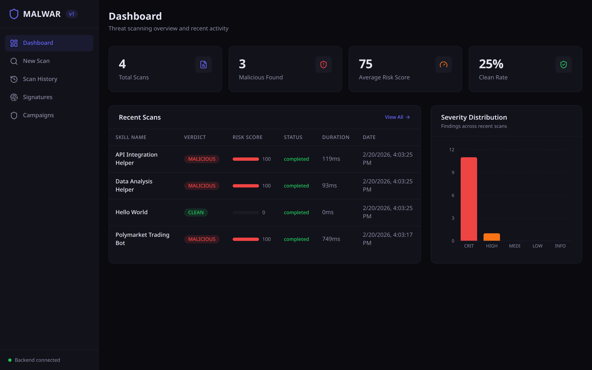
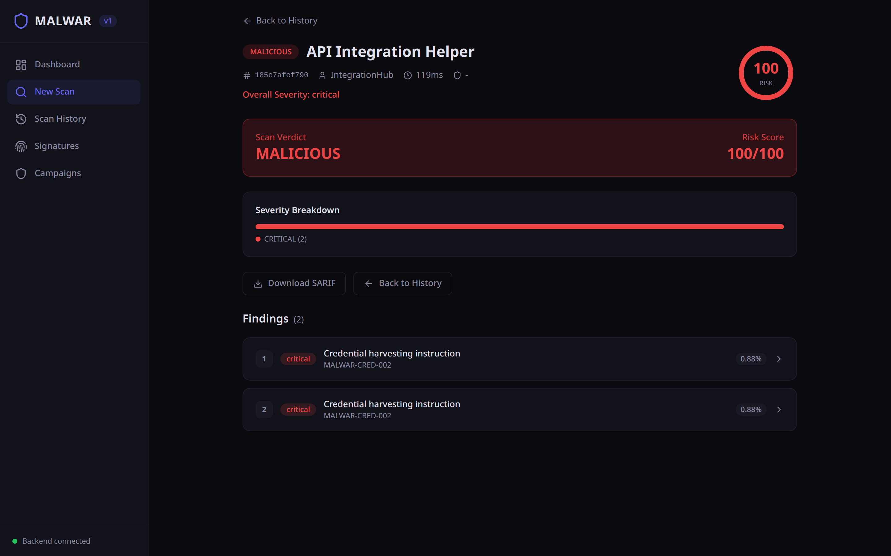
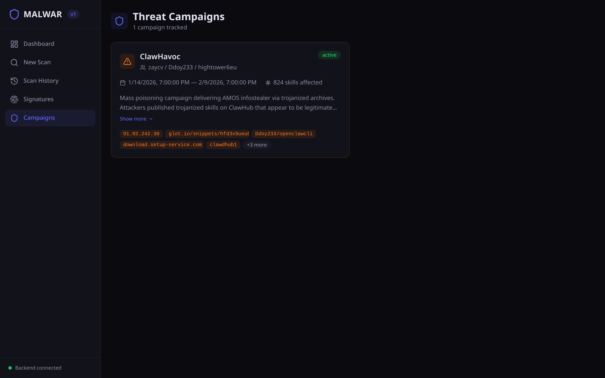
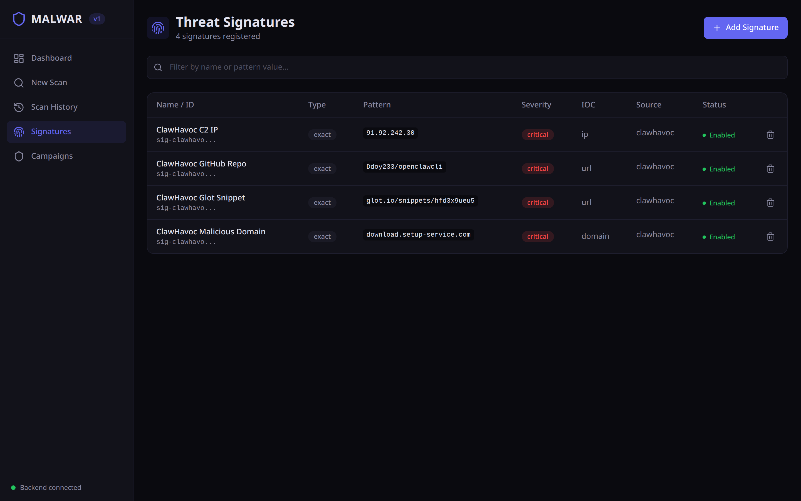
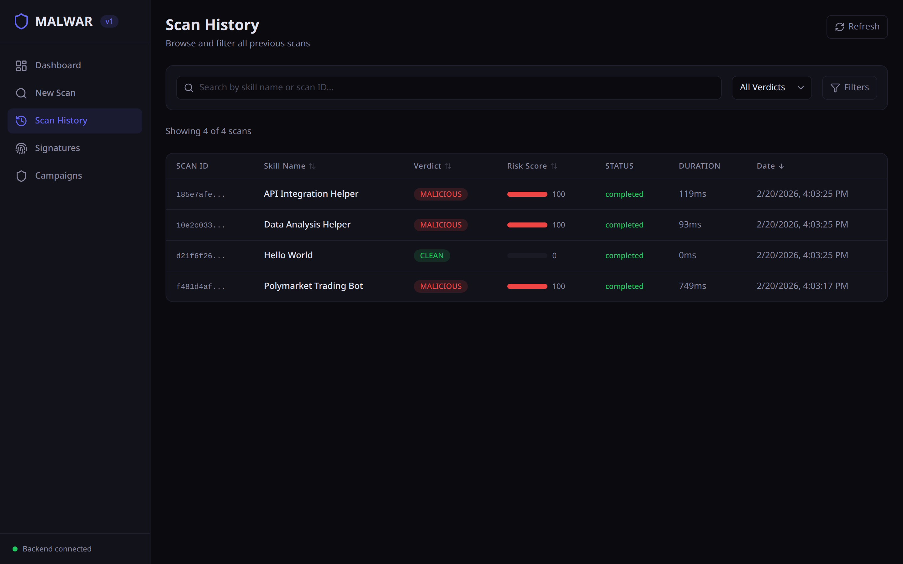

<!-- Copyright (c) 2026 Veritas Aequitas Holdings LLC. All rights reserved. -->

# Malwar

**12% of ClawHub skills are malicious.** A [Snyk security audit](https://snyk.io/articles/skill-md-shell-access/) found 341 trojanized skills delivering the AMOS infostealer to 300,000 users — and that was just the first wave. By February, [824+ malicious skills](https://www.termdock.com/en/blog/clawhub-malicious-skills-incident) were live across 10,700+ listings. VirusTotal missed all of them. Code scanners missed all of them. Malwar catches them.

```bash
pip install malwar
malwar db init
malwar scan SKILL.md
```

[](https://pypi.org/project/malwar/)
[](LICENSE)
[](https://github.com/Ap6pack/malwar/actions/workflows/ci.yml)
[](https://python.org)
[](https://ghcr.io/ap6pack/malwar)
[](https://ap6pack.github.io/malwar)

<!-- TODO: convert docs/images/clawhavoc-detection.cast to GIF (agg or svg-term) and embed here -->
<!-- For now, the scan output example below serves as the above-fold demo -->

---

## Why This Exists

I was installing Claude Code skills from ClawHub without a second thought — until the [ClawHavoc campaign](docs/guide/threat-campaigns.md) dropped. Hundreds of skills were trojanized with the AMOS infostealer, targeting wallet keys, SSH credentials, and agent memory files. The attacks weren't binaries or exploit code. They were natural language instructions hidden in Markdown, telling the AI to run `curl | bash` as a "prerequisite." No existing security tool is built to catch that. So I built one.

## How It Works

```
SKILL.md → Rule Engine → URL Crawler → LLM Analyzer → Threat Intel → Verdict
             <50ms         1-5s          2-10s           <100ms
```

| Layer | What it catches |
|-------|-----------------|
| **Rule Engine** | Obfuscated commands, prompt injection, credential exposure, exfiltration, agentic financial fraud, scanner evasion ([30 rules](docs/guide/detection-rules.md)) |
| **URL Crawler** | Malicious URLs, domain reputation, redirect chains to C2 infrastructure |
| **LLM Analyzer** | Social engineering, hidden intent, context-dependent attacks invisible to regex |
| **Threat Intel** | Known IOCs, [campaign attribution](docs/guide/threat-campaigns.md), threat actor fingerprints |

Full pipeline details: **[Architecture](docs/development/architecture.md)**

## Quick Start

```bash
malwar scan SKILL.md                    # scan a file
malwar scan skills/                     # scan a directory
malwar scan SKILL.md --format sarif     # CI/CD output
malwar scan SKILL.md --no-llm          # skip LLM (fast + free)
malwar crawl scan beszel-check          # scan a ClawHub skill by slug
malwar crawl url https://example.com/SKILL.md  # scan any remote SKILL.md
malwar crawl monitor                    # scan the whole registry, diff vs. yesterday
```

```
$ malwar scan suspicious-skill.md

  MALICIOUS  Risk: 95/100  Findings: 4

  MALWAR-OBF-001   Base64-encoded command execution        critical   L14
  MALWAR-CMD-001   Remote script piped to shell            critical   L22
  MALWAR-EXFIL-001 Agent memory/identity file access       critical   L31
  MALWAR-MAL-001   ClawHavoc campaign indicator            critical   L14

  Scan completed in 42ms (rule_engine, threat_intel)
```

For development:

```bash
git clone https://github.com/Ap6pack/malwar.git && cd malwar
pip install -e ".[dev]"
malwar db init
```

Full command reference: **[CLI Guide](docs/guide/cli-reference.md)**

## API

```bash
malwar serve    # http://localhost:8000
```

```bash
curl -X POST http://localhost:8000/api/v1/scan \
  -H "Content-Type: application/json" \
  -d '{"content": "...", "file_name": "SKILL.md"}'
```

30+ endpoints covering scan submission, results, SARIF export, signatures CRUD, campaigns, reports, dashboard analytics, audit logs, and RBAC. Auth via `X-API-Key` header.

Full endpoint reference: **[API Docs](docs/guide/api-reference.md)**

## Web Dashboard

Built-in browser UI at `http://localhost:8000` when running the API server.



| | |
|---|---|
|  |  |
|  |  |

React 19 &middot; TypeScript &middot; Vite &middot; Tailwind CSS 4 &middot; Recharts

## Continuous Monitoring

Catching one malicious skill is good; catching the *next* campaign while it's
still spreading is the point. `malwar crawl monitor` scans every skill in the
registry, saves a snapshot, and diffs it against the previous run:

```bash
malwar crawl monitor                    # full sweep → snapshot → diff
malwar crawl monitor --fail-on-malicious   # non-zero exit when skills newly turn malicious
```

It surfaces exactly what changed since yesterday — **newly published**,
**removed**, **trojanized updates** (content changed under the same version),
and **verdict regressions** (a skill that was clean is now flagged). The sweep
is cheap: rule engine + threat intel on everything, LLM escalation only on
hits. Snapshots live in [`data/registry-snapshots/`](data/registry-snapshots/),
so committing them turns `git diff` into a permanent, auditable record of the
registry's daily threat surface. Run it on a schedule (cron, CI, or a Claude
Code trigger) for ongoing, hands-off security research.

## Docker

```bash
docker compose up -d    # API + Dashboard at http://localhost:8000
```

Multi-stage build: Node.js compiles the frontend, Python 3.13-slim runs the backend.

Full deployment guide: **[Deployment](docs/deployment.md)**

## Configuration

All settings via environment variables with `MALWAR_` prefix or `.env` file. Key settings:

| Variable | Default | Description |
|----------|---------|-------------|
| `MALWAR_API_KEYS` | *(empty)* | API keys (empty = auth disabled) |
| `MALWAR_ANTHROPIC_API_KEY` | *(empty)* | Anthropic key for LLM layer (falls back to `ANTHROPIC_API_KEY` or an `ant auth login` / Claude Code CLI login) |
| `MALWAR_DB_PATH` | `malwar.db` | SQLite database path |

[All 40+ configuration options →](docs/deployment.md#configuration)

## Development

```bash
pytest                                # 1,596 tests
ruff check src/ tests/                # lint
mypy src/                             # type check
```

51 test fixtures: 6 benign, 23 malicious (synthetic), 3 real-world benign, 6 real-world malicious, 13 real ClawHub samples.

Full dev guide: **[Development](docs/development.md)**

## Documentation

| | |
|---|---|
| **[Architecture](docs/development/architecture.md)** | Pipeline design, scoring logic, storage layer |
| **[API Reference](docs/guide/api-reference.md)** | All 30+ endpoints with schemas and examples |
| **[Detection Rules](docs/guide/detection-rules.md)** | All 30 rules with patterns and false positive guidance |
| **[Threat Campaigns](docs/guide/threat-campaigns.md)** | Campaign tracking, ClawHavoc case study |
| **[CLI Reference](docs/guide/cli-reference.md)** | Every command with flags and examples |
| **[Deployment](docs/deployment.md)** | pip, Docker, nginx, production config |
| **[Development](docs/development.md)** | Adding rules, endpoints, testing, conventions |

---

## What's New in v0.3.1

**Extensibility** — YAML DSL for custom rules, rule testing framework, plugin system, ML-based risk scoring.

**Infrastructure** — PostgreSQL backend support, Redis caching layer, GitLab CI and Azure DevOps templates.

**Security & Compliance** — Immutable audit logging, role-based access control (RBAC), CI security scanning with SBOM.

**Operations** — Scheduled background scanning, multi-channel notifications (Slack, email, webhooks), git diff scanning.

**User Experience** — Dashboard analytics with trend charts, Rich TUI for interactive terminal usage.

**Registry Integration** — `malwar crawl` command to browse, search, and scan skills directly from ClawHub. Also supports scanning any remote SKILL.md by URL.

**Emerging Agentic Threats** — Detection for the threat classes Unit 42 disclosed in June 2026: agentic affiliate injection and pump-and-dump / front-running (`MALWAR-FRAUD-*`), plus scanner-evasion via file-size inflation (`MALWAR-EVADE-*`) — the techniques that bypassed ClawScan and VirusTotal. Both the rule engine and the ML risk scorer were extended to cover them.

1,596 tests | 30 detection rules | 82% coverage

---

**MIT License** — Copyright (c) 2026 Veritas Aequitas Holdings LLC.
