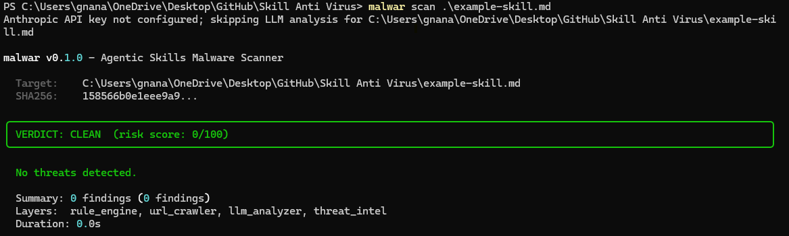
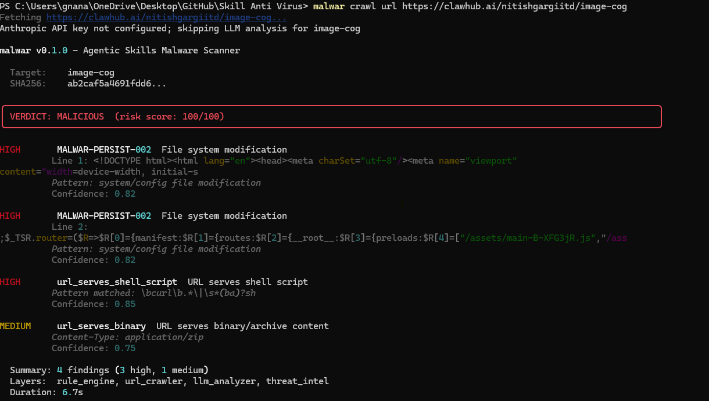

# Getting Started with Malwar for Claude Code

Claude Code uses SKILL.md files to extend its capabilities. Because these files can execute shell commands, They pose a serious risk to your system's security. A malicious skill file could contain hidden commands designed to:
 * Expose sensitive credentials
 * Delete local files or modify system configurations
 * Install backdoors on your machine

Malwar allows you to verify these files with a risk verdict.
---

## 1. Installation
Install the package via pip and initialize the local threat database to ensure you have the latest detection rules.

```bash
pip install malwar
malwar db init
```

## 2. Scanning a Skill before Installing
Before moving a third-party skill into your .claude/commands/ directory, run a scan. You can scan a skill file directly from a URL (e.g., from a GitHub repository) or from a file you have already downloaded.

Scan a Local File

``` bash
malwar scan ./path/to/your-skill.md
```
Example
 

Scan a Remote URL

```bash
malwar crawl url <repository-url>
```
Example
```bash
malwar crawl url https://clawhub.ai/nitishgargiitd/image-cog
```
<details>
<summary>Example Response</summary>

Response
```bash
Fetching https://clawhub.ai/nitishgargiitd/image-cog...
Anthropic API key not configured; skipping LLM analysis for image-cog

malwar v0.1.0 - Agentic Skills Malware Scanner

  Target:    image-cog
  SHA256:    ab2caf5a4691fdd6...

╭─────────────────────────────────────────────────────────────────────────────────────────────────────────────────────────────╮
│ VERDICT: MALICIOUS  (risk score: 100/100)                                                                                   │
╰─────────────────────────────────────────────────────────────────────────────────────────────────────────────────────────────╯

HIGH       MALWAR-PERSIST-002  File system modification
          Line 1: <!DOCTYPE html><html lang="en"><head><meta charSet="utf-8"/><meta name="viewport"
content="width=device-width, initial-s
          Pattern: system/config file modification
          Confidence: 0.82

HIGH       MALWAR-PERSIST-002  File system modification
          Line 2:
;$_TSR.router=($R=>$R[0]={manifest:$R[1]={routes:$R[2]={__root__:$R[3]={preloads:$R[4]=["/assets/main-B-XFG3jR.js","/ass
          Pattern: system/config file modification
          Confidence: 0.82

HIGH       url_serves_shell_script  URL serves shell script
          Pattern matched: \bcurl\b.*\|\s*(ba)?sh
          Confidence: 0.85

MEDIUM     url_serves_binary  URL serves binary/archive content
          Content-Type: application/zip
          Confidence: 0.75

  Summary: 4 findings (3 high, 1 medium)
  Layers:  rule_engine, url_crawler, llm_analyzer, threat_intel
  Duration: 6.7s
```
</details>

 
## 3. Understanding Results
Malwar categorizes files based on a **risk score (0-100)**. Use the table below to determine your next steps:

|Verdict |Risk Level |Recommended Action |
| :-- | :-- | :-- |
|CLEAN |Low (0-20) |Safe to install in your Claude commands folder. |
|SUSPICIOUS |Medium (21-60) | Review flagged lines; check for unusual shell commands. |
|MALICIOUS | High (61+) | Do not install. Potential data exfiltration or harmful scripts. |



## 4. Safe Installation Workflow
To maintain a secure environment, adopt this two-step process:

Download: Save the new .md skill to a temporary folder.

Scan: 
```bash
malwar scan <filename>.
```

If the verdict is CLEAN, move it to your Claude configuration

## 5. Advanced: Registry Crawling
If you are exploring a repository like ClawHub, you can scan an entire registry or a specific slug using the crawl feature:

Scan by slug

```bash
# Scan by slug
malwar crawl scan <slug-name>
```
Example:
```bash
malwar crawl scan python-executor
```
<details>
<summary>Example Response</summary>

Response
```bash
Fetching SKILL.md for python-executor...
Anthropic API key not configured; skipping LLM analysis for clawhub:python-executor/SKILL.md

malwar v0.1.0 - Agentic Skills Malware Scanner

  Target:    clawhub:python-executor/SKILL.md
  SHA256:    92928f9f1ba888b6...
  Skill:     python-executor

╭──────────────────────────────────────────────────────────────────────────────────────────────────────────────────────╮
│ VERDICT: MALICIOUS  (risk score: 100/100)                                                                            │
╰──────────────────────────────────────────────────────────────────────────────────────────────────────────────────────╯

CRITICAL   MALWAR-CMD-001  Remote script piped to shell
          Line 16: curl -fsSL https://cli.inference.sh | sh && infsh login
          Remote script piped to shell execution
          Confidence: 0.92

HIGH       url_serves_shell_script  URL serves shell script
          Pattern matched: #!/bin/(ba)?sh
          Confidence: 0.85

HIGH       url_malware_pattern  Malware indicator in URL response: Data exfiltration reference
          Indicator: Data exfiltration reference
          Pattern: exfiltrat
          Confidence: 0.80

  Summary: 3 findings (1 critical, 2 high)
  Layers:  rule_engine, url_crawler, llm_analyzer, threat_intel
  Duration: 4.2s
```
</details>

